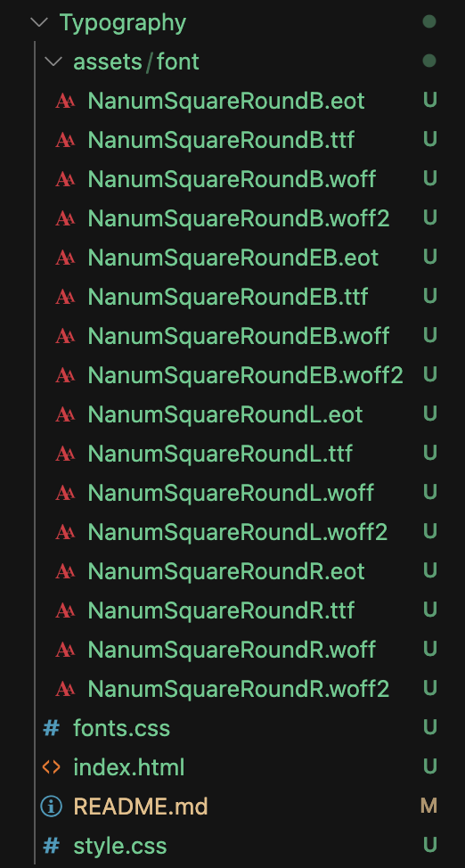
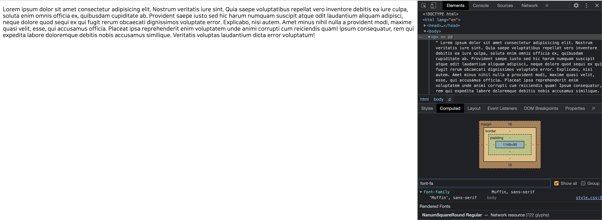

### Typography

Typography ? 텍스트(Text)를 예쁘게 디자인 하는 개념  

### 1. font-size 

> 글씨의 크기를 나타내는 속성  

사용하는 단위 : px, em, rem

px ? 절대 단위, 해상도를 지정할 때 1920x1080 로 지정한다면, width(너비)는 1920px이고, height(높이)는 1080px

em ? 상대 단위로, em단위가 있는 곳의 폰트사이즈의 배수

rem ? 상대 단위로, root(html) em의 약어인데 문서의 기본값의 배수 => rem단위는 html의 기본값의 배수이므로, 문서 전체의 기준값에 따라 달라진다.

### 2. line-height  

> 줄 간격을 표시하는 속성


### 3. letter-spacing

> 글 사이의 간격을 조정하는 속성으로 주로 px단위를 사용한다.

### 4. font-family

> 글씨의 서체를 나타내는 속성

```css
.text {
    font-family: "Poppins", "Roboto", sans-serif;
}
```

Poppins -> Roboto -> sans-serif 계열의 서체  

font-family의 속성 값으로 3가지를 적어주게 되면 Poppins 서체가 지금 내 폰트에 적용이 될 수 있다면 해당 서체를 사용하고 그게아니라면 Roboto 서체 이 서체도 존재하지 않다면 sans-serif계열의 서체를 사용하게 된다.  

serif ? 삐침이 있는 서체 (명조체)

sans-serif? 삐침이 없고 굵기가 일정한 서체(돋움, 고딕)  

### 5. font-weight

> 글씨의 굵기를 나타내는 속성

|Font-weight Value|Style|
|------|---|
|100|Thin|
|400|Regular|
|700|Bold|

### 6. color

> 글씨의 색상을 나타내는 속성

hex ? #191a1c => RGB 순서대로 16진수로 변환하여 00~ff 두자리씩 표기한다.

rgb ? rgb(25, 26, 28) => 각 red, green, blue를 나타내며 0 ~ 255 사이 숫자를 입력할 수 있다.

rgba ? rgba(25, 26, 28, 1) => red, green, blue, alpha 값 여기서 alpha는 0.0(완전 투명), 1.0(완전 불투명) 사이 값을 줄 수 있다.

### 7. text-align  

left : 왼쪽 정렬  

right: 오른쪽 정렬

center : 가운데 정렬  

### 8. text-indent

> 글씨 들여쓰기

### 9. text-transform

none : default  

capitalize : 스페이스 기준으로 첫 글자만 대문자

uppercase : 모든 문자 대문자

lowercase : 모든 문자 소문자

### 10. text-decoration  

> 줄 관련해서 글자를 꾸미는 속성

line-through : 글자 중간에 줄이 그어지는 형태  

underline: 글자 아래에 밑줄  

overline : 글자 위에 줄이 그어지는 형태

### 11. font-style  

> 글씨의 스타일

normal : default  

italic : 글씨를 기울임  

---

### Webfont  

내 프로젝트에 특정 웹 폰트 적용하는 법

1. 갖다 쓰기 : 대표적으로 구글에서 제공하는 폰트를 가져와서 사용할 수 있다.

```html
<link href="https://fonts.googleapis.com/css2?family=Quintessential&display=swap" rel="stylesheet">
```

```css
body { 
    font-family: 'Quintessential', cursive;
}
```

head태그 안에 위 처럼 link 태그로 가져온 후 모든 태그에 해당 폰트를 적용하기 위하여 body에 해당 폰트 적용!


2. 직접 제공 하는 방법  

https://github.com/innks/NanumSquareRound

위 사이트에서 제공하는 폰트를 zip 파일로 다운로드 받아서 적용해보자  

압축을 풀어 따로 해당 폰트들을 보관하는 폴더를 만들어 다음과 같이 셋팅하자. (폴더 이름은 뭘로 해도 무관하다)



긔고 폰트를 관리하는 파일로 fonts.css를 만들어주었다.

```css
@font-face {
    font-family: "Muffin";
    font-style: normal;
    font-weight: 300;
    /* url - format : 각 브라우저에 맞게 폰트 지원 지정 */  
    src: url('./assets/font/NanumSquareRoundL.eot');
    src: url('./assets/font/NanumSquareRoundL.eot?#iefix') format('embedded-opentype'),
         url('./assets/font/NanumSquareRoundL.woff2') format('woff2'),  
         url('./assets/font/NanumSquareRoundL.woff') format('woff'),
         url('./assets/font/NanumSquareRoundL.ttf') format('truetype');
}

@font-face {
    font-family: "Muffin";
    font-style: normal;
    font-weight: 400;
    /* url - format : 각 브라우저에 맞게 폰트 지원 지정 */  
    src: url('./assets/font/NanumSquareRoundR.eot');
    src: url('./assets/font/NanumSquareRoundR.eot?#iefix') format('embedded-opentype'),
         url('./assets/font/NanumSquareRoundR.woff2') format('woff2'),  
         url('./assets/font/NanumSquareRoundR.woff') format('woff'),
         url('./assets/font/NanumSquareRoundR.ttf') format('truetype');
}
```

폰트 이름을 'Muffin'으로 지정하였으며 font-weight 마다 적용하기 위해선 src 속성의 url 부분을 weight에 맞게 변경해주었다.  

  

> 여기서 개발자 도구 하단에 NanumSquareRound Regular—Network resource 문구를 볼 수 있는데 해당 문구는 내가 해당 폰트를 직접 제공했다는걸 의미한다.